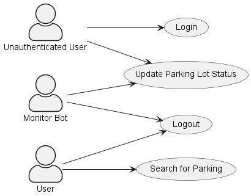

# Analysis and Design

## Unique Selling Point

Parking is an issue that contributes to traffic congestion especially in cities. Cars driving around and around a city for parking adds to the traffic. Cars hovering for parking spots or cars double parked can cause traffic to stop. The purpose of perfect parking is to try and solve the common problem of traffic congestion and scarcity of parking in a city such as Limerick. Perfect parking aims to ease the stress and anxiety that road users face searching for parking by providing live data about availability, pricing, stay-hours, zones, and disability status. Additional benefits include reducing traffic congestion, fuel savings, time and reduces stress.

## The Application

Perfect Parking is a web application that will allow users to find parking in a city. The application will allow users to search for parking near a specific location, and will show the user data the nearest parking to their location.

## Users Use Case Diagram

## System Actors

- Administrator: The administrator is responsible for managing the application. The administrator can add new parking locations to the database, and can also remove parking locations from the database.
- User: The user is the person who will be using the application. The user can search for parking near a specific location.
- Guest: The guest is a person who is not logged in to the application. The guest can only search for parking near a specific location.
- Monitor Bot: A monitor is a bot that will be monitoring a car park. The monitor will be updating the status of the car park.

## Use Case Descriptions

### Use Case: Find Parking

**Description:**

A user searches for parking near a specific location.

**Actors:**

- User

**Trigger Event:**

- A user wants to find parking near a specific location.

**Preconditions:**

- The user is logged in to the application.
- The website has permission to access the user's GPS location.

**Post conditions:**

- The user is shown a list of parking locations near the location they searched for.

 **Main Flow:**

1. The user details the location they want to find parking near by:
    - by searching for a specific address in the search bar.
    - by clicking on a location on the map.
    - by clicking on a location on the list of parking locations.
    - using the current location of the user.
2. The application shows the user a list of parking locations near the location they searched for.

 **Alternative Flows:**

- If the user does not have permission to access their GPS location, the user can search for a specific address in the search bar.

### Use Case: Register User

**Description:**

A user registers for an account on the application.

 **Actors:**

- Guest user

 **Trigger Event:**

- A guest user wants to register for an account on the application.

 **Preconditions:**

- The guest user is not logged in to the application.
- The guest user has not registered for an account on the application.
- The guest has a valid email address.

**Post conditions:**

- A user account is created for the guest user.

 **Main Flow:**

1. The guest user clicks on the "Register" button.
2. The guest user enters their details into the registration form.
3. The guest user clicks on the "Register" button.
4. The application creates a user account for the guest user.
5. The guest logs in to the application.

**Alternative Flows:**

- If the guest user enters an email address that is already registered to an account, the application will display an error message.

 **Use Case: Login User:**

**Description:**

A user logs in to the application.

 **Actors:**

- User

**Trigger Event:**

- A user wants to log in to the application.

**Preconditions:**

- The user is not logged in to the application.

**Post conditions:**

- The user is logged in to the application.

**Main Flow:**

1. The user clicks on the "Login" button.
2. The user enters their details into the login form.
3. The user clicks on the "Login" button.
4. The application logs the user in to the application.

**Alternative Flows:**

- If the user enters an incorrect username and password, the application will display an error message.
- If the user enters an username that is not registered to an account, the application will display an error message.
- If the user account is disabled, the application will display an error message.

### Use Case: Update Parking Lot Status

**Description:**

A monitor bot automatically updates the status of a parking lot.

**Actors:**

- Monitor

**Trigger Event:**

- A monitor updates the status of a parking lot.

**Preconditions:**

- The website application is running.
- The monitor is connected to the internet.
- The monitor has a valid API access token.

**Post conditions:**

- The status of the parking lot is updated.

**Main Flow:**

1. The monitor sends a PUT request to the application REST API.
2. The application updates the status of the parking lot.

**Alternative Flows:**

- If the monitor is not connected to the internet, the monitor will not be able to update the status of the parking lot.
- If the monitor API access token is invalid or has expired, the monitor will not be able to update the status of the parking lot.
- If the monitor sends an invalid request to the application REST API, the application will not update the status of the parking lot.
- If the parking lot does not exist in the database, the application will not update the status of the parking lot.

### Use Case: User changes password

**Description:**

A user changes their password.

**Actors:**

- User

**Trigger Event:**

- A user wants or is required to change their password.

**Preconditions:**

- The user is logged in to the application.

**Post conditions:**

- The user's password is changed.

**Main Flow:**

1. The user clicks on the "Change Password" button.
2. The user enters their details into the change password form.
3. The user clicks on the "Change Password" button.

**Alternative Flows:**

- If the user enters an incorrect password, the application will display an error message.
- If the user enters a new password that does not meet the password requirements, the application will display an error message.

## Identifying the free/busy car parking spaces

A key design goal of the application is to find a low-cost,  accurate, and scalable solution to identify if a car parking space is free or busy. To accomplish this goal, the application will use a combination of sensors and machine learning to identify if a car parking space is free or busy. The sensors will monitor the car parking space and will send data a  central server. The central server will then use machine learning algorithm to identify if the car parking space is free or busy.

## Machine Learning / Artificial Intelligence (AI)

Machine learning is a subset of artificial intelligence (AI) that uses algorithms to learn from data and make predictions. Machine learning is a key component of the application as it will be used to identify if a car parking space is free or busy. The machine learning algorithm will be trained using data collected from the sensors. The machine learning algorithm will then be used to identify if a car parking space is free or busy.

## Sensors

Overhead Cameras will watch the car parking space and will feed the video stream to a local client application. The local client application will use machine learning algorithms to identify if a car parking space is free or busy. The local client application will then send the status of the car parking space to the central server if it detects a change in the status of the car parking space.

### Development limitations

This being a trial application, with a limited budget and permission problems, for the purpose of a university project, the client application will receive a video stream from a prerecorded local video file instead of a camera.

## Machine Learning Algorithms

- OpenCV <https://opencv.org/>
- Hough Line Transform <https://docs.opencv.org/3.0-beta/doc/py_tutorials/py_imgproc/py_houghlines/py_houghlines.html>