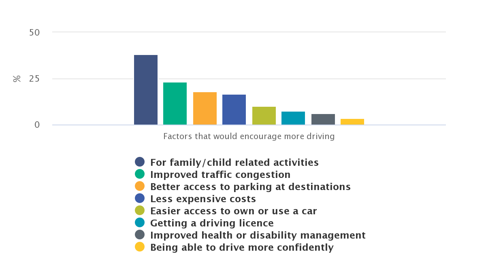
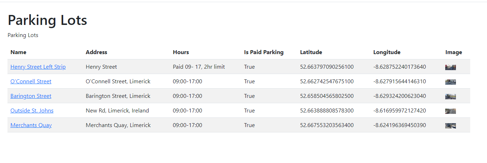
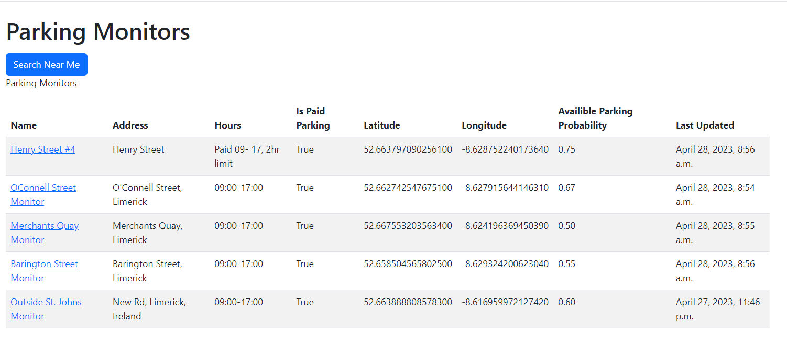
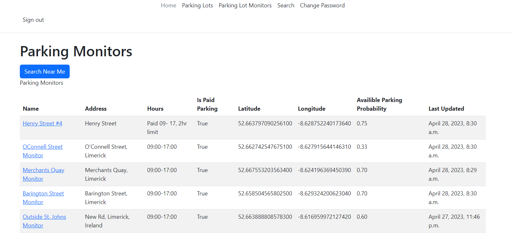

Perfect Parking

An AI Application to Assist Drivers Finding Parking in Busy Cities

Rhys Quilter

K00241356

A Final Year Project submitted as a requirement of the Technological
University of Shannon for the degree of Bachelor of Science (Honors) in
Software Development.

Supervised by:

John Jennings

# Acknowledgments

I would like to thank my supervisor John Jennings for helping me to
complete my research. In addition, I would like to thank my parents Sean
and Beverley, and my girlfriend Laura for their support during my time
at TUS.

# Ethical Declaration

I wish to declare that this project and document is wholly my own work
except where I have made explicit reference to the work of others. I
have read the Department of Information Technology Final Year Project
guidelines and relevant institutional regulations, and hereby declare
that this document is in line with these requirements.

I have discussed, agreed, and complied with whatever confidentiality or
anonymity terms of reference were deemed appropriate by those
participating in the research and dealt appropriately with any other
ethical matters arising, in line with the TUS Research Ethics Guidelines
for Undergraduate and Taught Postgraduate Programmes policy document.

  -----------------------------------------------------------------------
  **Rhys Quilter**                    May 1, 2023
  ----------------------------------- -----------------------------------

  -----------------------------------------------------------------------

# Abstract

*This project is a Parking application for academic purpose. The aim of
Perfect Parking is to create a parking system that will replace outdated
systems and to help stop the widespread problem that is parking in our
cities. The applications that are used in Limerick City are simply not
good enough. So, the goal in this project is to improve the
effectiveness of finding parking spaces and to also relieve the stress
of the users looking for parking by implementing new and innovative
features. I will do this by using the Django framework structure and by
implementing methods such as APIs that will show the user exactly where
the parking is and by providing locations for them to follow straight to
the location. I will also use a parking monitor powered by OpenCV to
detect if a parking spot has been filled or made empty. By doing this I
feel like it will also help with traffic congestion in the city as
people won't need to keep driving around the block to find a convenient
parking space.*

# Table of Contents {#table-of-contents .unnumbered}

[Acknowledgments [ii](#acknowledgments)](#acknowledgments)

[Ethical Declaration [iii](#ethical-declaration)](#ethical-declaration)

[Abstract [iv](#abstract)](#abstract)

[Table of Contents [v](#_Toc133600664)](#_Toc133600664)

[Table of Figure [ix](#table-of-figure)](#table-of-figure)

[Chapter 1 Introduction [10](#introduction)](#introduction)

[1.1 The academic objectives
[10](#the-academic-objectives)](#the-academic-objectives)

[1.2 The problem statement
[10](#the-problem-statement)](#the-problem-statement)

[1.3 Perfect Parking: a solution
[11](#perfect-parking-a-solution)](#perfect-parking-a-solution)

[1.4 Objectives [11](#objectives)](#objectives)

[1.5 The scope of the solution
[12](#the-scope-of-the-solution)](#the-scope-of-the-solution)

[1.6 Solution developed.
[12](#development-limitations)](#development-limitations)

[1.7 Report structure [12](#report-structure)](#report-structure)

[Chapter 2 Literature Review
[14](#literature-review)](#literature-review)

[2.1 Big Data and Realtime Data
[14](#big-data-and-realtime-data)](#big-data-and-realtime-data)

[2.1.1 What is Big Data? [14](#what-is-big-data)](#what-is-big-data)

[2.1.2 Why is Big Data important?
[14](#why-is-big-data-important)](#why-is-big-data-important)

[2.1.3 What is Real Time data
[15](#what-is-real-time-data)](#what-is-real-time-data)

[2.1.4 What is the importance of Real Time data?
[15](#what-is-the-importance-of-real-time-data)](#what-is-the-importance-of-real-time-data)

[2.2 Problems with gathering data.
[16](#problems-with-gathering-data.)](#problems-with-gathering-data.)

[2.3 Object Recognition and AI
[16](#object-recognition-and-ai)](#object-recognition-and-ai)

[2.3.1 Object Detection [16](#_Toc133600682)](#_Toc133600682)

[2.3.2 Cascading classifiers
[16](#cascading-classifiers)](#cascading-classifiers)

[2.3.3 The background of Classifiers (Haar-like features)
[17](#the-background-of-classifiers-haar-like-features)](#the-background-of-classifiers-haar-like-features)

[2.4 Parking Business Sector
[18](#parking-business-sector)](#parking-business-sector)

[2.4.1 Irish Trends [19](#irish-trends)](#irish-trends)

[2.4.2 Global Trends [19](#global-trends)](#global-trends)

[2.5 A Software Solution
[19](#a-software-solution)](#a-software-solution)

[Chapter 3 Analysis and Design
[21](#agile-development)](#agile-development)

[3.1 The Main Software Application
[21](#the-main-software-application)](#the-main-software-application)

[3.2 The supporting client Applications
[21](#the-supporting-client-applications)](#the-supporting-client-applications)

[3.3 Computer Vision: OpenCV
[21](#identifying-the-freebusy-car-parking-spaces)](#identifying-the-freebusy-car-parking-spaces)

[3.4 Users/Bots use-case Diagram.
[22](#usersbots-use-case-diagram.)](#usersbots-use-case-diagram.)

[3.5 System Actors [22](#anaconda)](#anaconda)

[3.6 Use Case Descriptions
[23](#usersbots-use-case-diagram.)](#usersbots-use-case-diagram.)

[3.6.1 Use Case: Find Parking
[23](#use-case-find-parking)](#use-case-find-parking)

[3.6.2 Use Case: Register User
[24](#use-case-register-user)](#use-case-register-user)

[3.6.3 Use Case: Update Parking Lot Status
[25](#use-case-update-parking-lot-status)](#use-case-update-parking-lot-status)

[3.6.4 Use Case: User changes password.
[26](#use-case-user-changes-password.)](#use-case-user-changes-password.)

[3.7 Website Layout
[27](#user-parking-sequence-diagram)](#user-parking-sequence-diagram)

[3.7.1 Parking Lots View [27](#parking-lots-view)](#parking-lots-view)

[3.7.2 Parking Lot View [27](#parking-lot-view)](#parking-lot-view)

[3.7.3 Parking Lot Monitors
[28](#parking-lot-monitors)](#parking-lot-monitors)

[3.7.4 Parking Lot Monitor
[29](#parking-lot-monitor)](#parking-lot-monitor)

[3.7.5 Know your Location Feature
[29](#know-your-location-feature)](#know-your-location-feature)

[3.7.6 Search Near Me [30](#search-near-me)](#search-near-me)

[3.8 Identifying the free/busy car parking spaces
[30](#identifying-the-freebusy-car-parking-spaces)](#identifying-the-freebusy-car-parking-spaces)

[3.9 Machine Learning / Artificial Intelligence (AI)
[31](#rest-api-layout)](#rest-api-layout)

[3.10 A look to the future [31](#_Toc133600709)](#_Toc133600709)

[3.10.1 Sensors [31](#sensors)](#sensors)

[3.10.2 Collecting of data
[31](#collecting-of-data)](#collecting-of-data)

[3.11 Development limitations
[32](#development-limitations)](#development-limitations)

[3.12 Database design [33](#anaconda)](#anaconda)

[3.13 User Parking Sequence diagram
[34](#user-parking-sequence-diagram)](#user-parking-sequence-diagram)

[3.14 Agile Development [34](#agile-development)](#agile-development)

[Chapter 4 Implementation [36](#implementation)](#implementation)

[4.1 How Object Recognition works in Perfect Parking clients
[36](#project-management)](#project-management)

[4.2 ParkingLot by Rocheeva [36](#the-client-app)](#the-client-app)

[4.2.1 Determining a parking space's status
[36](#determining-a-parking-spaces-status)](#determining-a-parking-spaces-status)

[4.2.2 A quick note on source code quality
[36](#a-quick-note-on-source-code-quality)](#a-quick-note-on-source-code-quality)

[4.2.3 How a parking space status is determined
[36](#how-a-parking-space-status-is-determined)](#how-a-parking-space-status-is-determined)

[4.3 Modifying ParkingLot
[37](#modifying-parkinglot)](#modifying-parkinglot)

[4.4 Perfect Parking Client additions to "ParkingLot"
[39](#perfect-parking-client-additions-to-parkinglot)](#perfect-parking-client-additions-to-parkinglot)

[4.5 Client and Server Architecture with Rest framework
[40](#perfect-parking-with-django)](#perfect-parking-with-django)

[4.5.1 The Monitor [40](#_Toc133600725)](#_Toc133600725)

[4.5.2 Server [40](#server)](#server)

[4.5.3 How They Work Together
[41](#how-they-work-together)](#how-they-work-together)

[4.6 Project Management [42](#project-management)](#project-management)

[4.6.1 Weekly Meetings [42](#_Toc133600729)](#_Toc133600729)

[4.6.2 Code Style Guide [42](#_Toc133600730)](#_Toc133600730)

[4.7 Source Control and versioning
[42](#source-control-and-versioning)](#source-control-and-versioning)

[4.8 Tools Used [43](#project-management)](#project-management)

[4.9 Django Rest API [43](#django-rest-api)](#django-rest-api)

[4.9.1 Perfect Parking with Django
[44](#perfect-parking-with-django)](#perfect-parking-with-django)

[4.10 Anaconda [45](#anaconda)](#anaconda)

[4.10.1 How to Install Anaconda
[45](#how-to-install-anaconda)](#how-to-install-anaconda)

[Chapter 5 Testing and Results
[47](#testing-and-results)](#testing-and-results)

[5.1 Unit Testing [47](#unit-testing)](#unit-testing)

[5.1.1 Unit Tests Used in The Project
[47](#unit-tests-used-in-the-project)](#unit-tests-used-in-the-project)

[5.2 Behaviour Driven Development (BBD) Testing
[48](#behaviour-driven-development-bbd-testing)](#behaviour-driven-development-bbd-testing)

[5.2.1 BDD In Perfect Parking
[49](#bdd-in-perfect-parking)](#bdd-in-perfect-parking)

[5.3 Test Driven Development (TDD)
[49](#test-driven-development-tdd)](#test-driven-development-tdd)

[5.3.1 TDD in Perfect Parking
[51](#tdd-in-perfect-parking)](#tdd-in-perfect-parking)

[5.4 Functionality [52](#functionality)](#functionality)

[5.5 Usability [52](#usability)](#usability)

[References [54](#future-development)](#future-development)

[Glossary [59](#glossary)](#glossary)

# Table of Figure

[Figure 1: CSO.ie - Factors that would encourage more driving,
[19](#_Toc133573279)](#_Toc133573279)

[Figure 2: User Use Case Diagram [22](#_Toc133414128)](#_Toc133414128)

[Figure 3: Parking Lots View [27](#_Toc133573281)](#_Toc133573281)

[Figure 4: Parking Lot View [28](#_Toc133573282)](#_Toc133573282)

[Figure 5: Parking lot Monitors View
[28](#_Toc133573283)](#_Toc133573283)

[Figure 7: Parking Lot Monitor View
[29](#_Toc133573284)](#_Toc133573284)

[Figure 8: Location Sharing [30](#_Toc133573285)](#_Toc133573285)

[Figure 9: Search Near Me Feature [30](#_Toc133573286)](#_Toc133573286)

[Figure 10 - Database Design [33](#_Toc132726761)](#_Toc132726761)

[Figure 11- User Parking Sequence Diagram
[34](#_Toc132726762)](#_Toc132726762)

[Figure 12: Agile Development (Feer, 2020)
[35](#_Toc133573289)](#_Toc133573289)

[Figure 13: How they work together [42](#_Toc133573290)](#_Toc133573290)

[Figure 14: BDD development cycle (Collidu, n.d.)
[49](#_Toc133573291)](#_Toc133573291)

[Figure 15: How TDD Works (BasuMallick, 2022)
[50](#_Toc133573292)](#_Toc133573292)

# Introduction

Due to an increase in in the number of cars being used in limerick city
and other cities in Ireland, finding a solution to car parks has now
become vital. The old-fashioned way of parking was that everyone would
just leave their cars parked in the streets until they were needed
again, this however caused major traffic congestions in towns and
cities. Shop owners also got hugely impacted as there wouldn't be enough
room for staff to park no mind the customers looking to go into their
shops which was damaging for their business, it is undeniable that car
parks are a very important factor in society, by having parking spaces
it reduces illegal parking which would have increased congestions on the
road and increasing travel time.

Parking back in the 1980s -- 1990s wasn't such a big issue as there
wasn't very many cars on the road as people couldn't afford to have a
car unless they were wealthy, nowadays however it is very hard to find
available parking spaces in places such as cities, and of course
universities especially during rush hour. Since limerick City is a big
city for students to come and study in with there being over 16,000
students attending university of limerick and just under 2000 students
in TUS and Mary I, this brings so much more motor vehicles into limerick
city which is a city already struggling with car parking. (University of
Limerick, 2022)

The goal is to try and reduce this issue by building a new innovative
parking app and to try to help motorists stop stressing about this
parking crisis.

## The academic objectives

The academic objectives of this project are to study and gain experience
working with AI and object detection in images. The chosen problem used
for this study is to help to reduce the traffic congestion in cities
such as Limerick.

## The problem statement

Ineffective ways of finding an available parking space which is a waste
of time, very fuel consuming and causes traffic jams. hen road users are
looking to find an available parking space they end up wasting time and
using a lot of fuel from them driving around the car park or the block
multiple times hopping to find a space, on average people spend 17 hours
per year driving around looking for parking spaces (Quellmalz, 2021). By
developing Perfect Parking, it is hoped to make the parking process in
college campus and in the city seamless and stress free, by doing this
I'm hoping to eliminate the time and fuel waste road users encounter
while looking for parking.

Lack of visual parking space availability.

When road users are driving the visuals of the eye are limited, the
vision is blocked by many obstacles such as the cars frame causing blind
spots, other cars, trees and much more. It can be understood that the
road users can find it difficult to spot an available parking space if
it's in the distance or behind other cars. This has turned into an
important problem with road users and as a result they waist time and
fuel trying to spot an available space. (Ponnambalam, 2020)

Lack of knowledge of towns or cities.

Limerick is a city where people migrate to for education or tourism, and
with this brings more road users. When drivers first come to Limerick
City, they must learn the road routes and with this where the parking
is. A lot of road users that drive in a new place start to panic and get
anxious when they try and find parking. This can cause them to be in the
wrong lanes and cause traffic congestion. But with the Perfect Parking
app it will allow users to plan their route to the parking of their
choice and follow directions on the phone to the car park. By doing this
that it will keep new road users in the city calm so they can enjoy
their holiday or for students teach them the road routes and the best
places to park.

## Perfect Parking: a solution

The time for a car park solution is long overdue in many Irish towns,
the solution is to create an application that monitors parking spaces
and sends updates to a web application for the users to query.

## Objectives

Perfect Parking application aims to develop a user-friendly parking
system that utilizes object detection technology. The technology watches
a video feed and allows the user to query for parking spaces in parking
areas. Once the parking monitor detects a change to a parking space it
pushes an update to the website with a probability of parking being
available. This application could be used in parking lots and towns
nationwide.

The objectives of this project solution are:

-   To provide a solution that can determine the status of the parking
    spots i.e., free or occupied.

-   To reduce the time motorists spend looking for parking in cities.

## The scope of the solution

The scope of the Perfect Parking solution is limited to the use of
prerecorded video demonstrations to showcase the car detection
capabilities of the application. Due to time and budget constraints,
live feeds from cities or colleges were not included in the scope of the
project. Instead, prerecorded videos were used to demonstrate the
application\'s ability to detect available parking spaces. The solution
also includes a server demonstration to showcase the end-user usage of
the application and its overall viability as a product. By focusing on
these key aspects of the application, the scope of the solution is
narrowed, allowing for a more focused and efficient development process.

### Development limitations

This being a trial application, with a limited budget and permission
problems, for the purpose of a university project, the client
application will receive a video stream from a pre-recorded local video
file instead of a camera.

## Solution developed

The developed solution is an AI application to assist drivers finding
parking in busy cities. The applications are written in Python; The
server is built on Django framework and, the client use the OpenCV
library to achieve computer object detection. The source code for the
applications can be viewed at
<https://github.com/rhys-lit/perfect-parking-fyp> .

## Report structure

This thesis is structured into five chapters:

Literature Review:

This chapter discusses the different types of data and the problems with
gathering data, it also discusses about object recognition and AI. The
literature review also touches on the parking business sector and the
global and Irish trends, while also discussing the software solution.

Analysis and Design:

This chapter discusses the design of the application such as the use
cases and the database design. The chapter also goes on to discuss about
computer vision and how OpenCV makes it possible.

Implementation:

This chapter discusses how the project was implemented. It also
discusses the tools that were used to develop this application such as
the Django framework and how other tools such as GitHub were used to
make the development possible.

Testing and Results:

The testing and results chapter goes on to show how different software
testing techniques were used to test the program such as Unit Testing.

Conclusions:

The Analysis and Design also discusses a look to the future which is
about how this project could be scaled up in the future.

# Literature Review

## Big Data and Realtime Data

A large amount of live data will be required to provide a comprehensive
parking software application solution.

### What is Big Data? 

Big Data is a combination of structured, semi structured, and
unstructured data that is collected by organizations, this data can be
mined for information to be used in many projects such as machine
learning, predictive modelling, and other analytics applications. Big
Data is often characterized by the three Vs.

-   The large **Volume** of data in many environments.

-   The wide **Variety** of data types frequently stored in Big Data
    systems.

-   The **velocity** at which much of the data is generated, collected,
    and processed.

These characteristics were first identified in 2001 by Doug Laney, they
were then further popularized in 2005 by an analyst at a consulting firm
called Meta Group.

Big Data doesn't equate to any specific amount of data, Big Data
deployments often involve terabytes, petabytes or even in some cases
exabytes of data that is created and collected over time. (Botelho,
2020).

### Why is Big Data important?

Big Data importance lies in the fact of how a company utilizes the
gathered data. Every company uses its gathered data in its own way, the
more a company can gather its data the more the company can grow.

Big Data provides valuable insights into customers that companies can
use to refine their marketing, advertising, and promotions by doing this
they can increase customer engagement and conversion rates. (TechVidan,
2022)

Big Data is huge in the medical industry, medical researchers can
identify disease signs and risk factors, this can help the doctors
diagnose illnesses and medical conditions in patients. A combination of
data from electronic health records and the web can give healthcare
organizations and government agencies up to date information on
infectious diseases threats or outbreaks, we have seen this in the past
with the pandemic and how the HSE in Ireland were able to monitor the
amount of covid -- 19 infections per county, and how they were able to
create the Covid App with this data. (Botelho, 2020)

### What is Real Time data

Real time data is data that is available as soon as its created and
acquired. Rather than being stored, data is pushed to users as soon as
its collected and is immediately available without and delay, this is
crucial for supporting live, in the moment decision making. This real
time data is a big part of our everyday lives, it powers everything from
bank transactions and GPS this was also seen in the many Covid-19 maps
that emerged during the pandemic. (Splunk, 2021)

We see a lot more of real time data then we think, Google collects
endless amounts of real time data and the way they do it is very smart,
they use a device that 6.6 billion people in the world have and that
being smart phones. (Turner, 2023) if people have smart phones, then
nearly everyone has the google map application and GPS in their phones.
When people sign into google on their phone Google starts creating real
time data through the GPS and other apps, for example, when your using
Google Maps on your phone it shows loads of data such as the estimated
time of arrival to your destination and also if there is any traffic on
your route, Google knows this by using real time data from other people
that are taking that route and that might be stuck in traffic and this
is all taken from the GPS location on smart phones. (Ashish, 2022)

### What is the importance of Real Time data?

Real-Time data is a necessity to stay relevant for today's business and
it needs to be delivered by sophisticated electronic communications
tools such as digital signage and data dashboards, to remain appealing
to today's tech savvy workforce from call centres to retailers.
(Barnett, 2017)

Real time data is important in many parking applications, these
applications use real-time data to show users if there is parking spaces
in the carpark which they have selected, this data can be gathered by
the carpark having a barrier that counts the amount of cars that go in
or the amount of cars that exit, some carparks also have sensors on each
of the parking spaces this allows users to see what actual spaces are
available, this is the most ideal as it allows people that need disabled
parking to see if that type of parking space is available.

## Problems with gathering data.

Collecting Big Data can be a challenging task that presents various
problems, irrespective of the domain or industry. The sheer amount of
data involved, which may be tiresome and challenging to handle, is one
of the main problems. Furthermore, the development and implementation of
the specialized tools and techniques needed for Big Data collection can
be expensive and time-consuming. Additionally, because the data is
frequently gathered from a variety of sources, some of which might not
be trustworthy, ensuring the quality and accuracy of the data can be a
significant challenge. In addition, Big Data analysis and interpretation
can be challenging tasks that need for specialized knowledge and
abilities to spot patterns, trends, and insights. Addressing these
challenges effectively is critical to realizing the potential benefits
of Big Data, including improved decision-making, increased efficiency,
and enhanced innovation. (Sharma, 2022)

## Object Recognition and AI

Object recognition refers to the process of teaching a computer how to
identify and classify objects within digital images or videos. It\'s
like teaching a child to recognize different objects such as cars,
chairs, or animals. Artificial intelligence, or AI, is the field of
computer science that deals with creating machines that can perform
tasks that typically require human intelligence, such as learning,
reasoning, and problem-solving. AI techniques like deep learning, which
is a subset of machine learning, are often used in object recognition
systems to train algorithms to recognize and classify objects. This
technology has a wide range of applications, from self-driving cars to
medical diagnosis to robotics. (Tech Target, n.d.)

### Object Detection

Object detection is a technique in computer vision that involves
detecting objects of interest within an image or video stream. Finding
the object(s) within a picture and categorizing them into various
categories are the goals of object detection. Since object detection
requires locating and recognizing multiple objects inside a picture, it
is a more advanced technique than object recognition (Patel, 2020).

### Cascading classifiers

Cascade classifiers One kind of machine learning technique used in
computer vision for object detection is called a cascading classifier.
In their groundbreaking study \"Rapid Object Detection using a Boosted
Cascade of Simple Features\" published in 2001, Viola and Jones
introduced them for the first time. The approach is based on the concept
of \"cascading\" the solution of a complex detection problem into
several smaller, easier sub-problems. (Michael Jones, 2001)

The basic idea behind cascading classifiers is to use a series of
classifiers, each with increasing complexity, to detect objects of
interest. Utilizing a series of classifiers, each with a higher level of
complexity, to find things of interest is the main notion underlying
cascading classifiers. The input image is classified as either
containing the object of interest or not by each classifier in the
cascade using a collection of features. Each classifier\'s attributes
are chosen based on their capacity to distinguish between positive and
negative samples. (Lee, 2022)

One of the main advantages of cascading classifiers is their ability to
achieve high detection rates with low false positive rates. This is
accomplished by employing several classifiers, each of which is trained
to quickly reject negative samples. As a result, there are fewer false
positives because the algorithm can swiftly reject pictures that don\'t
include the object of interest. (Bąk, 2023)

When used in object detection tasks like face detection, cascading
classifiers have been shown to be highly accurate and effective. (Bąk,
2023).

### The background of Classifiers (Haar-like features)

Classifiers are based upon Haar wavelets theory using Haar-like
features, which are extracted from images using rectangular filters and
then fed into a classifier to learn to distinguish between different
classes based on the extracted features.

An image feature type used in computer vision for object detection is
called a Haar-like feature. They have the name of the Haar wavelet,
which Alfred Haar, a Hungarian mathematician, initially proposed in
1909. (Seal, n.d.) The mathematical function known as the Haar wavelet
can be used to break down a signal or image into a collection of wavelet
coefficients.

By comparing the average pixel values in adjacent rectangular regions of
an image, Haar-like features can be extracted from the Haar wavelet. The
difference between the sum of pixel intensities in a rectangular region
with a light color and the sum of pixel intensities in a rectangle
region with a dark color is the precise definition of Haar-like features
(Arunachalam, 2014).

These rectangular areas can be positioned anywhere in the image and come
in a variety of sizes and shapes. It is feasible to gather details about
the texture and structure of a picture at various levels of granularity
by computing Haar-like features at various scales and positions in the
image.

A Haar Cascade Classifier basically works by detecting features in an
image that are characteristic of the object to be scanned for, such as
edges, corners, and lines. These features are then used to classify the
object.

Haar Cascade Classifiers can be trained to recognize specific objects,
such as faces, eyes, and cars, and the code is able to detect and
localize these objects within an image.

The Viola-Jones object detection technique, a well-liked algorithm for
face detection in photos, makes use of Haar-like features. In this
approach, a classifier is trained to differentiate between positive
instances (pictures containing the item of interest, such as faces) and
negative examples (images devoid of the object of interest), using a set
of Haar-like characteristics computed for each sub-region of an input
image. (Tyagi, 2021)

One of the advantages of using Haar-like features for object detection
is their computational efficiency. They are suitable for real-time
applications like video surveillance since they are rapid and effective
to compute utilizing integral images. (Bąk, 2023)

## Parking Business Sector

Parking management software is expected to see a compound annual growth
rate (CAGR) of 12.8% and expand to a global market size of \$11.3
billion by 2024. Additionally, it is anticipated that the market for
artificial intelligence (AI) in parking management will increase by 20%
yearly to \$1.5 billion by 2025. With these numbers in mind, it is
obvious that the parking sector needs creative solutions that can
harness the potential of AI to enhance parking management.

### Irish Trends

Statistics from the Central Statistics office (CSO) of Ireland gives
several suggestions that could encourage people to drive more in the
future. In the top three are traffic congestion, and access to parking.
(CSO.ie, 2019)

{width="5.896527777777778in"
height="3.160416666666667in"}

[]{#_Toc133573279 .anchor}Figure 1: CSO.ie - Factors that would
encourage more driving,

### Global Trends

The present approaches for locating parking spaces are inefficient and
wasteful, requiring a large amount of time and fuel. People spend an
average of 17 hours a year searching for parking spaces, according to
(McCoy, n.d.) and Irish people waste four days a year. (Sawer, 2017) the
solution intends to end this time and energy waste which will be
advantageous to both users and the environment.

It is anticipated that the global market for automated parking systems
will increase from \$1.3 billion in 2020 to \$3.6 billion in 2025. By
creating an AI-powered parking management system that can maximize
parking spot use, lessen traffic congestion, and more, the Perfect
Parking project seeks to meet this expanding need. and improve the
overall user experience for drivers. (abdalslam, 2023).

## A Software Solution

By leveraging the latest technologies and market trends, the Perfect
Parking project seeks to revolutionize the parking industry and provide
a comprehensive solution to the challenges faced by parking operators
and drivers alike.

In this project, the parking application is being created for
educational purposes to solve the widespread parking issue in our
cities. Time is lost, gasoline is consumed, and traffic is backed up due
to Limerick City\'s old and inefficient parking systems. To increase the
efficiency of identifying parking spaces and reduce the stress
experienced by users searching for parking spaces, a new and creative
software solution is required.

The lack of obvious availability of parking spaces is another issue with
the present parking schemes. Due to the limited vision created by
numerous obstructions like the car\'s frame, trees, or other vehicles,
drivers frequently struggle to find an open parking place. Users now
spend much more time and fuel because of this issue.

Furthermore, for new road users, finding parking spaces in a new place
can be a challenging task. In Limerick City, students and tourists come
from different regions to study or visit, and they must learn the road
routes and where the parking is. This lack of knowledge can cause them
to be in the wrong lanes and create traffic congestion. However, by
providing users with the option to plan their route to the parking of
their choice and follow directions on their phones to the car park, the
application can help users navigate the city\'s roads and reduce traffic
congestion.

To conclude, there is a pressing need for a software solution to address
the problems associated with parking in our cities. Perfect Parking aims
to provide a solution that is innovative, effective, and user-friendly,
with the potential to reduce time and fuel consumption, improve traffic
flow, and create a stress-free parking experience for all road users.

## Agile Development

Agile development is a software development methodology that emphasizes
flexibility, collaboration, and iterative development. Agile development
teams divide the work into smaller, more manageable chunks called
\"sprints\" rather than working on a project in a linear fashion with a
precise plan set in stone from the beginning. A working prototype or
product increment that can be tested and evaluated is produced by each
sprint, which lasts typically two to four weeks. Agile development
promotes regular communication and collaboration between team members
and stakeholders and favours working software over documentation. The
Agile manifesto identifies four basic values: valuing people over
processes and technologies, emphasizing working software over thorough
documentation, prioritizing communication with customers over contract
negotiations, and reacting to change over planning ahead. (atlassian,
n.d.)

{width="4.258333333333334in"
height="4.258333333333334in"}

[]{#_Toc133573289 .anchor}Figure 2: Agile Development (Feer, 2020)

# Analysis and Design

Parking is an issue that contributes to traffic congestion, especially
in cities. Cars driving around and around a city for parking adds to the
traffic. Cars hovering for parking spots or cars double parked can cause
traffic to stop. The purpose of perfect parking is to try and solve the
common problem of traffic congestion and scarcity of parking in a city
such as Limerick. Perfect parking aims to ease the stress and anxiety
that road users face searching for parking by providing live data about
availability, pricing, stay-hours, zones, and disability status.
Additional benefits include reducing traffic congestion, fuel savings,
time and reducing stress.

## The Main Software Application

Perfect Parking is a web application that will allow users to find
parking in a city. The application will allow users to search for
parking near a specific location and will show the user data the nearest
parking to their location.

## The supporting client Applications

The client applications monitor the video feeds and other sensors of
parking lots across a city and provides live updates to the Perfect
Parking website once a change in the car park is detected such as a spot
becomes available or is taken.

### Identifying the free/busy car parking spaces

A key design goal of the application is to find a low-cost, accurate,
and scalable solution to identify if a car parking space is free or
busy. To accomplish this goal, the application will use a combination of
sensors and machine learning to identify if a car parking space is free
or busy. The sensors will monitor the car parking space and will send
data to a central server. The central server will then use a machine
learning algorithm to identify if the car parking space is free or busy.

## 

### Computer Vision: OpenCV

The powerful library OpenCV provides a wide range of features for
computer vision applications. It is widely used across many different
industries, including robotics, driverless cars, medical imaging, and
more.

To extract useful information or features, OpenCV processes visual data,
such as photos or videos. Image filtering, feature detection, object
recognition, and tracking are just a few of the techniques that OpenCV
offers to process and analyze visual data. (Boesch, 2023)

Several pre-trained cascading classifiers, including the well-known Haar
cascades for face detection, are available in OpenCV for object
detection. A parking monitor app powered by OpenCV will be used to
detect if a parking spot has been filled or made empty, further
improving the effectiveness of the system.

### Anaconda

Anaconda is a popular distribution of the Python programming language
that is widely used for data science and scientific computing. It comes
with a sizable number of pre-installed libraries and tools that are
frequently used in these domains, including Jupyter Notebook, NumPy,
Pandas, and Matplotlib. (Root, 2020)

Anaconda is designed to make it easy to set up and manage Python
environments, which are essentially separate installations of Python
with their own dependencies and libraries. When working on several
projects with various requirements, this is especially helpful because
it enables you to keep them separate from one another. (Root, 2020)

The Conda package manager, which lets you easily install, update, and
manage additional software packages and libraries, is included with
Anaconda in addition to Python and its libraries. When working with
non-Python libraries that are necessary for your project, this can be
helpful. (McKinney, 2022)

Utilising Anaconda has several benefits, one of which is how much easier
it makes it to set up a Python environment for data research or
scientific computing. It removes the need to individually install and
configure each library, which can be a time-consuming and error-prone
operation, by offering a pre-built distribution with many of the
frequently used libraries already installed. (O Reilly, n.d.)

Overall, Anaconda is a robust and adaptable tool that is well-liked by
those who work in data research and scientific computing. Researchers,
developers, and data analysts all favour it because of how simple it is
to use and the extensive library of tools that are already installed.

### Django Rest API

Django is a popular web development framework that is written in Python.
It provides a set of tools and features that make it easy to build
complex web applications quickly and efficiently. Django was created by
Adrian Holovaty and Simon Willison in 2005, it features a vast
collection of classes, libraries and modules that can be implemented in
individual projects. With Django, you can create web applications that
follow the Model-View-Controller (MVC) architecture, which helps to
separate the different components of your application and make it easier
to manage. Additionally, Django comes with a lot of built-in
functionality, including an ORM for database interactions, an admin
interface for managing site content, and a templating system for
rendering HTML pages. Overall, Django is a powerful and flexible
framework that is well-suited for building all kinds of web
applications. (Johnson, n.d.)

## Database design

The database for this project comprises three tables: \"User\",
\"ParkingLotMonitor\", and \"ParkingLot\". Login information for users
of the parking application is kept in the \"User\" table. The
\"ParkingLot\" table keeps records of each parking lot\'s name, address,
image, operating hours, and method of payment while the
\"ParkingLotMonitor\" table keeps track of parking availability for
monitored car parks. The \"ParkingLotMonitor\" table is linked to the
\"ParkingLot\" table through the \"ParkingLotId\" column to enable the
parking application to track parking availability at each location.

{width="5.395833333333333in"
height="5.071345144356956in"}

[]{#_Toc132726761 .anchor}Figure 3 - Database Design

## System Actors

-   Administrator: The administrator is responsible for managing the
    application. The administrator can add new parking locations to the
    database and can also remove parking locations from the database.

-   User: The user is the person who will be using the application. The
    user can search for parking near a specific location.

-   Guest: The guest is a person who is not logged in to the
    application. The guest can only search for parking near a specific
    location.

-   Monitor Bot: A monitor is a bot that will be monitoring a car park.
    The monitor will be updating the status of the car park.

### Users/Bots use-case Diagram.

{width="5.694444444444445in"
height="4.458333333333333in"}

[]{#_Toc133414128 .anchor}Figure 4: User Use Case Diagram

## Use Case Descriptions

### Use Case: Find Parking

Description:

A user searches for parking near a specific location.

Actors:

-   User

Trigger Event:

-   A user wants to find parking near a specific location.

Preconditions:

-   The user is logged in to the application.

-   The website has permission to access the user's GPS location.

Post conditions:

-   The user is shown a list of parking locations near the location they
    searched for.

Main Flow:

1.  The user details the location they want to find parking nearby:

2.  by searching for a specific address in the search bar.

3.  by clicking on a location on the map.

4.  by clicking on a location on the list of parking locations.

5.  using the current location of the user.

6.  The application shows the user a list of parking locations near the
    location they searched for.

Alternative Flows:

-   If the user does not have permission to access their GPS location,
    the user can search for a specific address in the search bar.

### Use Case: Register User

Description:

A user registers for an account on the application.

Actors:

-   Guest user

Trigger Event:

-   A guest user wants to register for an account on the application.

Preconditions:

-   The guest user is not logged in to the application.

-   The guest user has not registered for an account on the application.

-   The guest has a valid email address.

Post conditions:

-   A user account is created for the guest user.

Main Flow:

1.  The guest user clicks on the "Register" button.

2.  The guest user enters their details into the registration form.

3.  The guest user clicks on the "Register" button.

4.  The application creates a user account for the guest user.

5.  The guest logs in to the application.

Alternative Flows:

-   If the guest user enters an email address that is already registered
    to an account, the application will display an error message.

Use Case: Login User:

Description:

A user logs in to the application.

Actors:

-   User

Trigger Event:

-   A user wants to log in to the application.

Preconditions:

-   The user is not logged in to the application.

Post conditions:

-   The user is logged in to the application.

Main Flow:

1.  The user clicks on the "Login" button.

2.  The user enters their details into the login form.

3.  The user clicks on the "Login" button.

4.  The application logs the user into the application.

Alternative Flows:

-   If the user enters an incorrect username and password, the
    application will display an error message.

-   If the user enters a username that is not registered to an account,
    the application will display an error message.

-   If the user account is disabled, the application will display an
    error message.

### Use Case: Update Parking Lot Status

Description:

A monitor bot automatically updates the status of a parking lot.

Actors:

-   Monitor

Trigger Event:

-   A monitor updates the status of a parking lot.

Preconditions:

-   The status of the parking lot is not updated

Post conditions:

-   The status of the parking lot is updated.

Main Flow:

-   The monitor sends a PUT request to the application REST API.

-   The application updates the status of the parking lot.

Alternative Flows:

-   If the monitor is not connected to the internet, the monitor will
    not be able to update the status of the parking lot.

-   If the monitor API access token is invalid or has expired, the
    monitor will not be able to update the status of the parking lot.

-   If the monitor sends an invalid request to the application REST API,
    the application will not update the status of the parking lot.

-   If the parking lot does not exist in the database, the application
    will not update the status of the parking lot.

### Use Case: User changes password.

Description:

-   A user changes their password.

Actors:

-   User

Trigger Event:

-   A user wants or is required to change their password.

Preconditions:

-   The user is logged in to the application.

Post conditions:

-   The user's password is changed.

Main Flow:

1.  The user clicks on the "Change Password" button.

2.  The user enters their details into the change password form.

3.  The user clicks on the "Change Password" button.

Alternative Flows:

-   If the user enters an incorrect password, the application will
    display an error message.

-   If the user enters a new password that does not meet the password
    requirements, the application will display an error message.

## User Parking Sequence diagram

{width="5.905555555555556in"
height="2.1in"}

[]{#_Toc132726762 .anchor}Figure 5- User Parking Sequence Diagram

this is the sequence diagram of the process where a user is searching
for parking near their location using the application. The user asks the
app if there is parking available near their GPS location on Henry
Street.

To check if parking is available in each lot the software queries
multiple parking lot monitors:

-   Henry St Parking Lot Monitor

-   O' Connell Street Parking Lot Monitor

-   Merchants Quay Parking Lot Monitor

-   Barrington Street Parking Lot Monitor

-   St. Johns Parking Lot Monitor

The Henry St Parking Lot Monitor responds that parking is 97% available,
O'Connell Street Parking Lot Monitor responds 87%, Merchants Quay
Parking Lot Monitor 65%, Barrington Street Parking Lot Monitor 45%. And
St. Johns Parking Lot Monitor 75%

Finally, the application then sends a response to the user indicating
that there are 5 parking lots available near their location, with the
names The Henry St, O'Connell Street, Merchants Quay, Barrington Street.

## Website Layout

### Parking Lots View

Clicking on the parking lots in the navigation bar will display a list
of the parking lots available with some information about the different
parking lots.

{width="6.6075240594925635in"
height="2.218305993000875in"}

[]{#_Toc133573281 .anchor}Figure 6: Parking Lots View

### Parking Lot View

Clicking on a parking lot name will display information on the selected
parking lot such as a map and an image of the car park as well as other
information about that specific parking lot.

{width="5.865909886264217in"
height="4.149245406824147in"}

[]{#_Toc133573282 .anchor}Figure 7: Parking Lot View

### Parking Lot Monitors

Clicking on the parking Monitors in the navigation bar will display a
list of the parking lots available that are being monitored. The user
will be asked to share the location by the browser. Information such as
the probability of parking available is displayed which updates whenever
there is a change in parking behaviour.

{width="6.52001312335958in"
height="3.1174004811898515in"}

[]{#_Toc133573283 .anchor}Figure 8: Parking lot Monitors View

### Parking Lot Monitor 

Clicking on the parking Monitor name it will display information on that
specific parking monitor such as a location on the google map number of
free spaces and the probability of the spaces available which updates
every time there is a change and the website is refreshed. In the image
below you can see that the probability has changed for this specific
parking lot compared to Figure 5 above.

{width="6.650247156605424in"
height="4.893287401574804in"}

[]{#_Toc133573284 .anchor}Figure 9: Parking Lot Monitor View

### Know your Location Feature

When the parking lot monitors page is loaded for the first time the
browser will ask you to share your location. This is done so the Search
near me feature can be used.

{width="3.4689293525809273in"
height="2.8643963254593174in"}

[]{#_Toc133573285 .anchor}Figure 10: Location Sharing

### Search Near Me

When the search near me button is clicked it organises the parking lots
that are monitored by how close they are to your location.

{width="5.905555555555556in"
height="3.0840277777777776in"}

[]{#_Toc133573286 .anchor}Figure 11: Search Near Me Feature

## Rest API layout

Django Rest Framework is a powerful and flexible toolkit for building
Web APIs. Some of the key features of interest in the Django Rest
framework:

-   The Web Browsable API that allows developers to explore and interact
    with the API using a web browser.

-   Authentication policies

-   Serialization: Django Rest Framework provides powerful serialization
    capabilities

### Django Rest Framework

This is the Django Rest Framework API Root page; you can see all the
endpoints from the application.

{width="5.905555555555556in"
height="2.29375in"}

Figure 12: Django Rest Framework API Root

The two of the most interesting endpoints would be parking-lots and
parking-lot-monitors:

{width="5.905555555555556in"
height="4.209722222222222in"}

Figure 13: Parking Lot List

{width="5.905555555555556in"
height="4.06875in"}

Figure 14: Parking Lot Monitor List

## Machine Learning / Artificial Intelligence (AI)

Machine learning is a subset of artificial intelligence (AI) that uses
algorithms to learn from data and make predictions. Machine learning is
a key component of the application as it will be used to identify if a
car parking space is free or busy. The machine learning algorithm will
be trained using data collected from the sensors. The machine learning
algorithm will then be used to identify if a car parking space is free
or busy.

# Implementation

In this chapter the implementation of Perfect parking is discussed with
regard to (1) .. (2) .. (3) .. and 4

## Project Management

During the time doing the final year project weekly supervisor meetings
were held. These meetings were very useful for asking questions, and
keeping the project on track, the supervisor was very supportive and
gave great feedback when it was needed to ensure that the project was
kept on track. With his guidance and great knowledge, it allowed the
Perfect Parking application to be completed with a high standard and
within a timely manner.

## Source Control and versioning

For source control and versioning, GitHub was utilized to manage the
codebase for the project. GitHub was chosen because of prior experience
using it during other studies, and it provided a reliable platform for
version control and collaboration with the supervisor. It allows for
easy upkeep and to keep track of changes made during each week and
easily roll back to previous versions if needed.

Additionally, the supervisor was added as a collaborator on the
repository, allowing him to view the progress and provide feedback on
the code and documents. This facilitated effective communication and
ensured that the project was aligned with the objectives.

One significant advantage of using GitHub was that it provided a safe
and secure backup of the code. In the event of file corruption, it would
be possible to pull down the last push request and continue the work
without losing progress.

## Tools Used

Python: An interpreted, object-oriented, high-level programming language
with dynamic semantics.

Libraries and Frameworks:

-   Django web framework, which allowed for rapid development of the
    application website/server and easy maintenance.

-   OpenCV, an open-source computer vision and machine learning software
    library, which was used for image processing and analysis.

Tools:

-   VS Code: A lightweight code editor with support for many languages
    and debugging.

-   Anaconda: a package management, and deployment tool to install and
    manage required libraries and dependencies.

-   Microsoft Word: used to write the documentation.

-   Canva: a graphic design platform used to create the project poster.

-   Mermaid.live: used to create markdown diagrams.

By utilizing these tools, languages, and frameworks, the project was
completed more efficiently, with greater accuracy and precision.

### How to Install Anaconda

-   Download the Appropriate Anaconda installer from the [Anaconda
    Website](https://www.anaconda.com/download/)

-   Open VS Code and open a new terminal window by selecting
    \"Terminal\" from the top menu and then selecting \"New Terminal.

-   Navigate to the directory where you downloaded the Anaconda
    installer using the command **cd \<directory\>**.

-   For example, if you downloaded the Anaconda installer for Windows
    and saved it in your Downloads folder, you would type the following
    command in the terminal:

> 1\.     cd Downloads

-   Run the Anaconda installer by typing the command **bash \<Anaconda
    installer filename\>** in the terminal, where **\<Anaconda installer
    filename\>** is the name of the Anaconda installer file you
    downloaded.

> 1\. bash Anaconda3-2021.05\--x86_64.sh   

-   Follow the instructions in the Anaconda installer to complete the
    installation process.

-   Once the installation is complete, you can use Anaconda in the VS
    Code terminal by activating the Anaconda environment with the
    command **conda activate**. You can then use the various Anaconda
    packages and tools in the terminal as needed.

-   For example, if you want to use the Pandas library in your Python
    script, you can first activate the Anaconda environment by typing
    the following command in the terminal:

> 1\.     conda activate

-   Then, you can import the Pandas library in your Python script using
    the following line of code:

> 1\.     import pandas as pd

-   This will allow you to use the various functions and methods
    provided by the Pandas library in your project.

## How Object Recognition works in Perfect Parking clients

The Perfect Parking Server receives parking status data from client
applications. A client monitor app is responsible for processing video
and determining if parking is available. A proof-of-concept project by
Olga Rocheeva was sourced on GitHub and built upon to work with Perfect
Parking. (Rocheeva, 2018)

## The Client App

### ParkingLot by Rocheeva

The project ParkingLot preforms various pre-processing techniques on an
image such as grey-scaling and blurring to reduce noise, to improve the
accuracy of the object detection and to identify if vehicles are present
or not in the designated parking spaces. The programme overlays the
designated parking spaces onto the video, initialising them as available
or occupied depending on the presence of cars. The code can identify
when a car is present in a location by analyzing the average pixel
intensity within the marked area and comparing it to a threshold value.
A location is regarded as available if the average intensity is below
the threshold value and seen as occupied if it is above the threshold.

#### Determining a parking space's status

The function detectmotion() in motion_detector.py is responsible for
determining if the status of parking spaces.

#### A quick note on source code quality

The function detectmotion() has Cognitive Complexity value of 33 well
above the allowed 15 according to sonarlint (Sonar Rules, n.d.) and
refactoring the function is recommended. Also, the code seems to lack a
consistent intuitive naming convention coupled with a sever lack of much
needed comments.

#### How a parking space status is determined

As best as far as this author can figure; the following sections of
detect motion are responsible for determining the average pixel insanity
of a marked location (coordinates).

1\. def detect_motion(self):

2\.     \# \...

3\.     coordinates = self.\_coordinates(p)

4\.    

5\.  

6\.     rect = open_cv.boundingRect(coordinates)

7\.    

8\.  

9\.     new_coordinates = coordinates.copy()

10\.     new_coordinates\[:, 0\] = coordinates\[:, 0\] - rect\[0\]

11\.     new_coordinates\[:, 1\] = coordinates\[:, 1\] - rect\[1\]

12\.     \# \...

13\.  

14\.     \# \...

15\.  

16\.     mask = open_cv.drawContours(

17\.         np.zeros((rect\[3\], rect\[2\]), dtype=np.uint8),

18\.         \[new_coordinates\],

19\.         contourIdx=-1,

20\.         color=255,

21\.         thickness=-1,

22\.         lineType=open_cv.LINE_8)

23\.  

24\.     mask = mask == 255

25\.     self.mask.append(mask)

26\.    

27\.     \# \...

28\.  

### Modifying ParkingLot

Changes

-   Config files to hold application configuration data and sensitive
    information.

> 1\. \[ParkingLotMonitor\]
>
> 2\. Id=1
>
> 3\. Name=Henry Street
>
> 4\. Latitude=52.663797090256100
>
> 5\. Longitude=-8.628752240173640
>
> 6\.  
>
> 7\. \[App\]
>
> 8\. Token=YOUR_TOKEN
>
> 9\. Username=YOUR_USERNAME
>
> 10\. Password=YOUR_PASSWORD
>
> 11\. ServerUrl=http://127.0.0.1:8000/api-auth/parking-lot-monitors/

sample config.ini

-   A Plain Old Common Object (POCO) ParkingMonitorData class was added
    to hold data about a parking lot monitor i.e., A Parking Lot
    Monitor's Id, Name, Latitude, Longitude, Number of Parking Spaces,
    and the App's Authentication Token, Username, Password, and the
    Server's URL. The ParkingMonitorData class uses Config Parser to
    load the Parking Lot Monitor's data from config files keeping best
    practices of separating sensitive data from the source code.

> 1\. from configparser import ConfigParser
>
> 2\.  
>
> 3\. class ParkingMonitorData:
>
> 4\.  
>
> 5\.     def \_\_init\_\_(self, config_filepath: str =
> \"PerfectParkingClient/config.ini\"):
>
> 6\.         config_parser: ConfigParser = ConfigParser()
>
> 7\.  
>
> 8\.         config_parser.read(config_filepath)
>
> 9\.  
>
> 10\.         self.id =
> config_parser\[\"ParkingLotMonitor\"\]\[\"Id\"\]
>
> 11\.         self.name =
> config_parser\[\"ParkingLotMonitor\"\]\[\"Name\"\]
>
> 12\.         self.latitude =
> config_parser\[\"ParkingLotMonitor\"\]\[\"Latitude\"\]
>
> 13\.         self.longitude =
> config_parser\[\"ParkingLotMonitor\"\]\[\"Longitude\"\]
>
> 14\.         self.parking_spaces =
> config_parser\[\"ParkingLotMonitor\"\]\[\"ParkingSpaces\"\]
>
> 15\.  
>
> 16\.         self.app_token = config_parser\[\"App\"\]\[\"Token\"\]
>
> 17\.         self.app_username =
> config_parser\[\"App\"\]\[\"Username\"\]
>
> 18\.         self.app_password =
> config_parser\[\"App\"\]\[\"Password\"\]
>
> 19\.         self.server_url =
> config_parser\[\"App\"\]\[\"ServerUrl\"\]

perfectparking.py -- class ParkingMonitorData

-   For educational and assessment purposes only the config files
    (containing usernames and passwords) have been uploaded to GitHub.
    The gitignore file was modified to allow sensitive .ini files to be
    posted to GitHub.

> 1\. #\*.ini

.gitignore

-   The constructor of MotionDetector was modified to inject in
    ParkingMonitorData.

> 1\. #\...
>
> 2\. class MotionDetector:
>
> 3\.     LAPLACIAN = 1.4
>
> 4\.     DETECT_DELAY = 1
>
> 5\.  
>
> 6\.     def \_\_init\_\_(self, video, coordinates, start_frame,
> parking_monitor_data: ParkingMonitorData):
>
> 7\.         self.video = video
>
> 8\.         self.coordinates_data = coordinates
>
> 9\.         self.start_frame = start_frame
>
> 10\.         self.contours = \[\]
>
> 11\.         self.bounds = \[\]
>
> 12\.         self.mask = \[\]
>
> 13\.         self.parking_monitor_data = parking_monitor_data
>
> 14\.         #\...  

motion_detector.py - class MotionDetector

-   A "method on_free_parking_spaces_changed" was added to handle the
    event of a change to the number of available parking spaces.

> 1\. def on_free_parking_spaces_changed(self, spaces_in_frame: int,
> free_spaces_in_frame: float) -\> None:
>
> 2\.     probability_parking_available =
> free_spaces_in_frame/spaces_in_frame
>
> 3\.     RestApiUtility.update_server_parking_monitor_data(
>
> 4\.         self.parking_monitor_data, free_spaces_in_frame,
> probability_parking_available)  

motion_detector.py - class MotionDetector - new method

-   A Rest API class was added to send updates to the server.

> 1\. from requests.auth import HTTPBasicAuth
>
> 2\. import requests
>
> 3\.  
>
> 4\. #\...
>
> 5\. class RestApiUtility:
>
> 6\.    
>
> 7\.     \@staticmethod
>
> 8\.     def update_server_parking_monitor_data(parking_monitor_data:
> ParkingMonitorData, free_spaces_in_frame: float,
>
> 9\.                                          
>  probability_parking_available: float) -\> requests.Response:
>
> 10\.         \"\"\"\...\"\"\"
>
> 11\.  
>
> 12\.     \@staticmethod
>
> 13\.     def build_parking_monitor_data_json(parking_monitor_data:
> ParkingMonitorData, free_spaces_in_frame: float,
>
> 14\.                                        
> probability_parking_available: float) -\> dict:
>
> 15\.         \"\"\"\...\"\"\"
>
> 16\.  
>
> 17\.     \@staticmethod
>
> 18\.     def
> build_and_send_parking_monitor_data_put_request(parking_monitor_data:
> ParkingMonitorData,
>
> 19\.                                                        
> request_json: dict) -\> requests.Response:
>
> 20\.         \"\"\"\...\"\"\"
>
> 21\.  
>
> 22\.     \@staticmethod
>
> 23\.     def send_put_request(parking_monitor_data:
> ParkingMonitorData, request_headers: dict,
>
> 24\.                          request_json: dict, request_url: str)
> -\> requests.Response:
>
> 25\.         http_basic_auth =
> HTTPBasicAuth(parking_monitor_data.app_username,
>
> 26\.                                        
> parking_monitor_data.app_password)
>
> 27\.         response = requests.put(request_url,
>
> 28\.                                 auth=http_basic_auth,
>
> 29\.                                 headers=request_headers,
>
> 30\.                                 json=request_json)
>
> 31\.  
>
> 32\.         return response

perfectparking.py -- class RestApiUtility

-   The purpose of this class is to update and send parking monitor data
    to a server using HTTP PUT request.

### Perfect Parking Client additions to "ParkingLot"

RestApi as well as to deliver real-time updates on parking spot
availability.

## Perfect Parking with Django

The Perfect Parking application was created using the popular web
framework Django for a variety of reasons.

Firstly, Django is a high-level web framework that follows the
Model-View-Controller (MVC) architectural pattern, which promotes code
organization and separation of concerns. This allows for the development
of complex programmes with numerous components without compromising the
maintainability of the code.

Secondly, Django provides a lot of built-in functionality out of the
box, which saves time and effort during development. For example, Django
includes an Object-Relational Mapping (ORM) system that allows
developers to interact with databases using Python objects, as well as a
robust authentication system for user management.

Thirdly, Django has an engaged community that actively supports the
framework\'s growth and upkeep. This indicates that a wide variety of
third-party packages and extensions are readily available and can
increase the capabilities of the framework and speed up development.

Along with these benefits, Django\'s outstanding documentation,
scalability, and security capabilities are some of the other benefits of
adopting it for web development. Django is also open-source and free,
which makes it available to a variety of developers and organisations.

Overall, the decision to use Django for the Perfect Parking application
was based on its combination of ease of use, built-in functionality, and
strong community support, which makes it a popular choice for building
web applications of all sizes and complexities.

## Client and Server Architecture with Rest framework

### Server

The server-side code for this Django project consists of several files,
including admin.py, apps.py, models.py, serializers.py, urls.py, and
views.py.

admin.py registers the app\'s ParkingLot and ParkingLotMonitor models
with Django\'s admin site.

apps.py defines the app\'s configuration, including its name and default
auto field.

models.py defines the data structures of ParkingLot and
ParkingLotMoniton.

{width="1.6993766404199475in"
height="3.2812445319335084in"}

Figure 15: Class Diagram

serializers.py defines the serializers used to convert the ParkingLot
and ParkingLotMonitor models to JSON format for use in the app\'s API.

urls.py defines the app\'s URLs, including paths for the home page,
parking lots list, parking lot detail page, user registration,

user login, user logout, and API endpoints for the ParkingLot and
ParkingLotMonitor models.

views.py contains the logic for rendering the app\'s web pages, handling
user input, and providing data to the app\'s API endpoints. It includes
functions for rendering the home page, parking lot list, parking lot
detail page, user registration, user login, and user logout pages. It
also includes functions for handling API requests, including getting a
list of all parking lots, getting details for a specific parking lot,
and updating the parking lot monitor data.

Overall, the client-side code is responsible for providing a
user-friendly interface for the app, handling user input and
interactions, and communicating with the server-side code to retrieve
and display data.

### How They Work Together

The client and server communicate with each other through the REST API
service. When the client sends a request to the server, it includes
information such as the endpoint to access, any data to send in the
request body, and any headers to include with the request. The
server-side code receives the request and processes it, querying the
database or performing other operations based on the data included in
the request. The server then sends a response back to the client, which
includes a status code indicating whether the request was successful or
not, any data to include in the response body, and any headers to
include with the response. The client-side then processes the response,
displaying the data on the website for probability of parking available
so the user can view it. This cycle of request and response is how the
client and server are linked together in a web application.

{width="4.080948162729658in"
height="2.5342760279965004in"}

[]{#_Toc133573290 .anchor}Figure 16: How they work together

# Testing and Results

## Unit Testing

Unit tests are a type of software testing that involves testing
individual units or components of a larger software system. Unit
testing\'s goal is to verify that every single piece of code is
operating as intended and adhering to design specifications. (TechTarget
, 2023)

In most cases, developers write unit tests as they write the
application\'s code, these tests are usually automated. They are made to
be quickly and regularly executed, enabling programmers to and correct
flaws early in the development cycle. (Ingrassellino, 2021)

Developers write code to test every individual function, method, or
class in the software system during unit testing. To make sure that the
code generates the desired output for each combination of inputs, they
supply test data and anticipated results for each unit before running
the tests. (Kolodiy, n.d.)

For software to be dependable, manageable, and scalable, unit tests are
crucial. They can assist in identifying issues early in the development
process, which makes fixing them simpler and less expensive.
Additionally, they aid in ensuring that modifications to the code don\'t
ruin already-existing functionality. (Ingrassellino, 2021)

Overall, unit tests are an important part of the software development
process and are essential for ensuring the quality and reliability of
software applications.

### Unit Tests Used in The Project

this unit test is verifying that the update_server_parking_monitor_data
method is correctly updating the parking monitor data on the server and
returning the expected response status code.

1\. def test_update_server_parking_monitor_data(self):

2\.     parking_monitor_data = ParkingMonitorData()

3\.     free_spaces_in_frame: float = 3

4\.     probability_parking_available: 0.5  # (3/6)

5\.     response: request.Response =
RestApiUtility.update_server_parking_monitor_data(

6\.         parking_monitor_data, free_spaces_in_frame,
probability_parking_available

7\.     )

8\.     expected_response_status_code = 200

9\.     self.assertEqual(response.status_code,
expected_response_status_code)

ParkingLot/tests/test.py

To run the tests, open a terminal and enter the code:

1\. python -m unittest /parking_lot/tests/parking_lot_tests.py

Unit Test Terminal run command.

## Behaviour Driven Development (BBD) Testing

A software development process called behaviour-driven development (BDD)
expands on the ideas behind test-driven development (TDD). But it
emphasises cooperation and communication more than ever between
technical and non-technical stakeholders. The goal of BDD is to
guarantee that everyone involved with the development process is aware
of the specifications and goals for the software that is being created.
(Tricentis, 2018)

Instead of just developing and passing tests, BDD focuses on defining
and implementing the software\'s expected behaviour. This is
accomplished by using the specialised language \"Gherkin,\" which
enables programmers, testers, and business stakeholders to specify the
desired behaviour of the software in a form that is clear to all
parties. (Das, 2022)

One of the key benefits of BDD is that it helps to ensure that everyone
involved in the development process is on the same page. The danger of
miscommunication and misunderstandings between technical and
non-technical stakeholders is reduced by establishing a common
vocabulary and outlining the desired behaviour of the software up front.
(Das, 2022)

BDD also has the potential to raise the bar on the software that is
being created. Developers and testers may make sure that the software
satisfies the needs and expectations of the end users by concentrating
on the desired behaviour of the product.

BDD also promotes team member participation and communication, which can
assist to break down silos and make sure that everyone is working
towards the same objective. This can lead to greater efficiency and
productivity, as well as a more positive and collaborative working
environment. (Testingxperts, 2023)

Overall, Behaviour-driven development (BDD) is an approach to software
development that places a strong emphasis on collaboration and
communication between technical and non-technical stakeholders. By
defining the desired behaviour of the software upfront and using a
common language, it can help to ensure that everyone involved in the
development process is working towards a common goal and that the
software being developed meets the requirements and expectations of the
end-users.

{width="4.025in"
height="2.2642989938757654in"}

[]{#_Toc133573291 .anchor}Figure 17: BDD development cycle (Collidu,
n.d.)

### BDD In Perfect Parking

BDD testing was not used during the development of the Perfect Parking
application due to limited time available for its implementation. As a
solo developer in the project, collaboration with others was not
possible, the time and effort required for BDD testing was perceived as
a barrier to meeting project deadlines.

However, if there were plans to develop a large new project, there are
still several reasons why BDD testing would be considered. First, BDD
testing can help ensure that software meets the business requirements
and user needs, which can result in a higher quality product that better
meets the needs of users.

Finally, BDD testing can also help improve developers understanding of
the project requirements and improve the efficiency of the development
process.

Overall, while limited time and a lack of collaboration may have made it
difficult to implement BDD testing in the development of the Perfect
Parking application, there are still many benefits to using BDD testing
in a new solo project that make it worth considering.

## Test Driven Development (TDD)

A software development process called Test-Driven Development (TDD)
places a strong emphasis on creating automated tests before creating any
production code. In test-driven development (TDD), the developer creates
a test that outlines a desired software feature or behaviour, runs the
test to discover its failure, and then writes the code to make the test
pass. The process is then repeated with additional tests until the
desired functionality is complete. (Unadkat, 2023)

With TDD, the developer is forced to consider the desired behaviour of
the code before actually developing it because tests must be written
first. This produces more modular, maintainable code that is also less
prone to problems. It also allows for easier refactoring of code later,
as the tests act as a safety net to catch any unintended changes that
may have been introduced. (Santacroce, 2022)

TDD typically involves theses following steps:

-   **Writing a failing test:** The developer purposefully constructs a
    test that fails even though it defines the desired behaviour of the
    code. The test is written before writing any code for production.

-   **Write the minimum amount of code to make the test pass:** The
    developer then creates the minimum amount of code required to pass
    the failing test. This code was written exclusively for the purpose
    of passing the test.

-   **Refactor the code:** When the test passes, the developer can
    refactor the code without affecting its functionality in order to
    make it easier to maintain.

-   **Repeat:** The developer then repeats the process with additional
    tests until the desired functionality is complete. (Steinfeld, 2020)

{width="3.4380238407699037in"
height="2.775in"}

[]{#_Toc133573292 .anchor}Figure 18: How TDD Works (BasuMallick, 2022)

TDD can help increase productivity in addition to code quality by
decreasing time spent on debugging and by establishing a clear set of
requirements for the software being built. It does, however, require
some upfront effort in writing the tests upfront, which may not be
desirable for smaller projects or teams with fewer resources.

Overall, TDD is a powerful technique for writing high-quality,
maintainable code, and can be especially useful in larger, more complex
software projects.

### TDD in Perfect Parking

TDD wasn't used in the development of Perfect Parking for several
reasons. Firstly, when working on a solo project, it didn't feel
necessary to write the tests because the code could be simply tested as
its written. Additionally, it can be difficult to justify the additional
time investment required for TDD when working on the project solo.
However, even on a solo project, TDD can help to ensure that the code is
of high quality and easier to maintain. Additionally, writing tests
upfront can help to prevent regressions and ensure that the code works
as expected, even if you come back to the project months or years later.

Secondly, TDD also wasn't used in the development of the solo project,
such as the Perfect Parking application, was due to the limited
knowledge of TDD and the lack of time to learn how to implement it
effectively.

In conclusion, there are several good reasons why TDD might not have
been used in the creation of your Perfect Parking. These include
the lack of familiarity with TDD and the lack of free time to learn more
about it. However, learning about TDD might be a worthwhile time and
effort investment if interested in developing abilities and producing
higher quality code.

If another project was to be developed in the future TDD would be
implemented for several reasons:

Firstly, TDD can help ensure that the code is well-structured and
maintainable, which can be especially important for larger projects.

Secondly, TDD can help improve the quality of the code. By promoting
modular, reusable, and maintainable code, TDD can ensure that each
component of the code works as intended and fits into the larger system.

Thirdly, TDD can increase confidence in code changes. By having a
comprehensive suite of tests, developers can be confident that their
code changes will not negatively affect other parts of the system.

Lastly, TDD can improve collaboration between developers and teams. By
providing a common language for discussing code changes and ensuring
that everyone is on the same page in terms of what the code should do,
TDD can reduce communication errors and misunderstandings between
developers.

In conclusion, using TDD in a software development project can result in
higher-quality code, a better user experience, and increased developer
efficiency. TDD can ensure the success of upcoming project by
identifying problems earlier in the development process, encouraging
modular and maintainable code, boosting confidence in code
modifications, and enhancing teamwork.

## Functionality

During testing, the Perfect Parking application demonstrated strong
functionality in displaying the availability of parking spots based on
real-time data collected by the ParkingLotMonitor. The ParkingLotMonitor
allows the user to mark out parking spots that they want to be
continuously monitored for their occupancy status. Whenever there is a
change in the availability of a parking spot the mapped-out spaces turn
green for available and red for occupied, the monitor sends the
probability of it being available to the Perfect Parking application.
The application then displays the availability of the car park to the
user in real-time by displaying the probability of available parking
spaces, Overall, the application\'s functionality met the project\'s
objectives and proved to be a valuable tool for drivers seeking parking
in urban or congested areas. However, some minor issues were identified
during testing, such as if a shadow is casted over a parking spot and it
changes the colour gradient in the space the monitor would think that
the space is full when in theory it's not. If the project was to go
further in the future this minor issue would be fixed.

## Usability

The usability of the ParkingLotMonitor and Perfect Parking website were
both tested during the evaluation process. The ParkingLotMonitor
interface was found to be intuitive and user-friendly, allowing a user
to easily mark out and monitor parking spots. The monitor also
accurately reported the availability of parking spots in real-time, with
color-coding providing a clear visual indication of the status of each
spot. The Perfect Parking website was also found to be intuitive and
easy to use. The website provided an interface where users could view
the availability of parking spots in real-time. The website allowed
signed-in users to view a car park\'s availability, and when the car
park was selected, it showed a Google map of the parking location, where
they could get directions to the car park if they wish. Overall, the
usability of both the ParkingLotMonitor and Perfect Parking website was
strong, with minimal issues or confusion reported during testing.

# Conclusions 

Based on the research and analysis conducted in this project, it can be
concluded that the use of AI and object detection in images is an
effective solution for identifying the status of parking spots
(free/taken) in towns and cities such as Limerick. By implementing this
technology, it is possible to monitor car parks in real-time,

## Future Development

While developing the Perfect Parking application there was a challenge
when it came to incorporating parking sensors into the application. Due
to budget and time constraints, it was determined that such sensors were
beyond the scope of the project. While doing the project it was
recognized that parking sensors would have been a valuable addition to
the application but understood that this would require collecting large
amounts of personal data from users.

### Sensors

Overhead Cameras will watch the car parking space and will feed the
video stream to a local client application.

### Collecting of data

A possible solution is to build a parking space sensor using a raspberry
pi and putting this down in a parking space in either the college or in
the city, but be aware of doing this brings problems:

-   Permission must be sought from the parking companies to allow
    sensors to be placed on their parking premises.

-   If permission is granted the sensor would only be on a raspberry pi
    it could easily get damaged or stolen.

## Knowledge gained

In this FYP, I have gained a deep understanding of computer vision
techniques and their practical applications using OpenCV. Additionally,
I have learned about the historical development of Haar classifiers and
wavelets, which has helped me to appreciate the evolution of these key
concepts in the field.

Furthermore, I have honed my programming skills, particularly in Python,
through the implementation of this project. This experience has taught
me valuable lessons in project management, design, and implementation. I
am proud of my accomplishments and feel that I have made a meaningful
contribution to the field of computer vision through my work.

Overall, the knowledge I have gained and the skills I have developed
have broadened my understanding of computer vision and have prepared me
to take on new challenges in this exciting and rapidly evolving field. I
am grateful for the opportunity to have pursued this research and look
forward to applying my new skills and knowledge in future endeavours.

## Thesis wrap up

To conclude this thesis, it has been a challenging yet rewarding journey
that has allowed me to delve deeply into the field of computer vision.
Through my research and implementation of the FYP project, I have gained
valuable knowledge and skills that will serve me well in my future
academic and professional pursuits.

I have explored the rich history of Haar classifiers and wavelets and
gained a thorough understanding of computer vision techniques using
OpenCV. Additionally, I have honed my programming skills, particularly
in Python, and developed valuable experience in managing and
implementing a large-scale project.

Overall, I believe that this thesis represents a meaningful contribution
to the field of computer vision, and I hope that it will inspire further
research and innovation in this area. I am grateful for the guidance and
support of my Supervisor, and I am proud of the work that I have
accomplished.

As I move forward from this thesis, I look forward to applying the
knowledge and skills I have gained in my future academic and
professional pursuits. I am excited to see where this journey will take
me and am confident that the experiences and lessons learned from this
thesis will continue to guide me throughout my career.

# References

abdalslam, 2023. *Parking Management Statistics, Trends And Facts 2023.*
\[Online\]\
Available at:
[https://abdalslam.com/parking-management-statistics#parking-management-statistics]{.underline}\
\[Accessed 27 04 2023\].

Arunachalam, H., 2014. *Image Segmentation for the Extraction of Face.*
, Rajiv Gandhi: s.n.

Ashish, 2022. \[Online\]\
Available at:
[https://www.scienceabc.com/innovation/how-does-google-maps-know-about-traffic-conditions.html#:\~:text=Google%20Traffic%20works%20by%20crowdsourcing,geographic%20location%20with%20the%20app.]{.underline}

atlassian, n.d. *What is Agile?.* \[Online\]\
Available at: [https://www.atlassian.com/agile]{.underline}\
\[Accessed 27 04 2023\].

Bąk, K., 2023. *Cascade Classifier: Approach to Object Detection.*
\[Online\]\
Available at:
[https://53jk1.medium.com/cascade-classifier-approach-to-object-detection-890ef859cc53]{.underline}\
\[Accessed 24 04 2023\].

Barnett, M., 2017. \[Online\]\
Available at:
[https://www.fourthsource.com/data/importance-real-time-data-five-reasons-need-22014]{.underline}

BasuMallick, C., 2022. *What Is TDD (Test Driven Development)? Process,
Importance, and Limitations.* \[Online\]\
Available at:
[https://www.spiceworks.com/tech/devops/articles/what-is-tdd/]{.underline}\
\[Accessed 27 04 2023\].

Boesch, G., 2023. *What is OpenCV? The Complete Guide (2023).*
\[Online\]\
Available at: [https://viso.ai/computer-vision/opencv/]{.underline}\
\[Accessed 23 May 2023\].

Botelho, B., 2020. *Big Data.* \[Online\]\
Available at:
[https://www.techtarget.com/searchdatamanagement/definition/big-data]{.underline}\
\[Accessed 16 02 2022\].

Collidu, n.d. *Behavior Driven Development (BDD).* \[Online\]\
Available at:
[https://www.collidu.com/presentation-behavior-driven-development-bdd]{.underline}\
\[Accessed 26 04 2023\].

CSO.ie, 2019. *National Travel Survey 2019.* \[Online\]\
Available at:
[https://www.cso.ie/en/releasesandpublications/ep/p-nts/nationaltravelsurvey2019/carusage/]{.underline}\
\[Accessed 27 04 2023\].

Das, S., 2022. *BDD Testing: A Detailed Guide.* \[Online\]\
Available at:
[https://www.browserstack.com/guide/what-is-bdd-testing]{.underline}\
\[Accessed 26 04 2023\].

Das, S., 2022. *Benefits of Test Management and BDD in Software Testing
Process.* \[Online\]\
Available at:
[https://www.browserstack.com/guide/benefits-of-test-management-and-bdd]{.underline}\
\[Accessed 26 04 2023\].

Feer, J. v. d., 2020. *Be a Boss.* \[Online\]\
Available at:
[https://fiches-pratiques.chefdentreprise.com/Thematique/gestion-1050/FichePratique/Les-raisons-utiliser-methodes-Agile-entreprise-354321.htm]{.underline}\
\[Accessed 27 04 2023\].

Ingrassellino, J., 2021. *Why Should Software Testers Understand Unit
Testing?.* \[Online\]\
Available at:
[https://applitools.com/blog/why-should-software-testers-understand-unit-testing/]{.underline}\
\[Accessed 26 04 2023\].

Johnson, S., n.d. *What Is Django and What Is Django Used for?.*
\[Online\]\
Available at:
[https://www.stxnext.com/blog/what-is-django/]{.underline}\
\[Accessed 24 04 2023\].

Kolodiy, S., n.d. *Unit Testing and Coding: Why Testable Code Matters.*
\[Online\]\
Available at:
[https://www.toptal.com/qa/how-to-write-testable-code-and-why-it-matters]{.underline}\
\[Accessed 26 04 2023\].

Lee, D., 2022. *Cascade Classifiers.* \[Online\]\
Available at:
[https://apmonitor.com/pds/index.php/Main/CascadeClassifier]{.underline}\
\[Accessed 24th April 2023\].

McCoy, K., n.d. *Drivers spend an average of 17 hours a year searching
for parking spots.* \[Online\]\
Available at:
[https://eu.usatoday.com/story/money/2017/07/12/parking-pain-causes-financial-and-personal-strain/467637001/]{.underline}\
\[Accessed 24 04 2023\].

McKinney, D., 2022. *What is Conda.* \[Online\]\
Available at: [https://cloudsmith.com/blog/what-is-conda/]{.underline}\
\[Accessed 27 04 2023\].

Michael Jones, P. V., 2001. *Rapid Object Detection using a Boosted
Cascade of Simple.* \[Online\]\
Available at:
[https://www.cs.cmu.edu/\~efros/courses/LBMV07/Papers/viola-cvpr-01.pdf]{.underline}\
\[Accessed 23 May 2023\].

O Reilly, n.d. *Advantages of Anaconda.* \[Online\]\
Available at:
[https://www.oreilly.com/library/view/mobile-artificial-intelligence/9781789344073/9ef54367-7a36-4064-ae81-e65ce25e80bb.xhtml]{.underline}\
\[Accessed 27 04 2023\].

Patel, A., 2020. *What is Object Detection?.* \[Online\]\
Available at:
[https://medium.com/ml-research-lab/what-is-object-detection-51f9d872ece7]{.underline}\
\[Accessed 23 May 2023\].

Ponnambalam, C. T., 2020. *Searching for Street Parking: Effects on
Driver Vehicle Control, Workload, Physiology, and Glances.* \[Online\]\
Available at:
[https://www.frontiersin.org/articles/10.3389/fpsyg.2020.574262/full]{.underline}\
\[Accessed 12 12 2022\].

Quellmalz, R., 2021. *6 surprising facts about parking you probably dont
know.* \[Online\]\
Available at:
[https://www.spotparking.com.au/insights/facts-about-parking-you-probably-didnt-know]{.underline}

Rocheeva, O., 2018. *Parking Space Detection in OpenCV.* \[Online\]\
Available at: [https://github.com/olgarose/ParkingLot]{.underline}\
\[Accessed 20 Febuary 2023\].

Root, D., 2020. *An Overview of The Anaconda Distribution.* \[Online\]\
Available at:
[https://towardsdatascience.com/an-overview-of-the-anaconda-distribution-9479ff1859e6]{.underline}\
\[Accessed 27 04 2023\].

Santacroce, F., 2022. *Test-Driven Development (TDD): A Time-Tested
Recipe for Quality Software.* \[Online\]\
Available at:
[https://semaphoreci.com/blog/test-driven-development]{.underline}\
\[Accessed 27 04 2023\].

Sawer, P., 2017. *Search for parking spaces cost drivers four days a
year.* \[Online\]\
Available at:
[https://www.independent.ie/regionals/herald/news/search-for-parking-spaces-costs-drivers-four-days-a-year-35416591.html]{.underline}\
\[Accessed 24 04 2023\].

Seal, A., n.d. Thermal Human face recognition based on Haar wavelet. In:
s.l.:s.n., p. 12.

Sharma, R., 2022. *Top 6 Major Challenges of Big Data & Simple Solutions
To Solve Them.* \[Online\]\
Available at:
[https://www.upgrad.com/blog/major-challenges-of-big-data]{.underline}\
\[Accessed 15 01 2023\].

Sonar Rules, n.d. *Python static code analysis.* \[Online\]\
Available at:
[https://rules.sonarsource.com/python/RSPEC-3776]{.underline}\
\[Accessed 28 04 2023\].

Splunk, 2021. \[Online\]\
Available at:
[https://www.splunk.com/en_us/data-insider/what-is-real-time-data.html]{.underline}\
\[Accessed 03 April 2023\].

Steinfeld, G., 2020. *5 steps of test-driven development.* \[Online\]\
Available at:
[https://developer.ibm.com/articles/5-steps-of-test-driven-development/]{.underline}\
\[Accessed 27 04 2023\].

Tech Target, n.d. *object recognition.* \[Online\]\
Available at:
[https://www.techtarget.com/whatis/definition/object-recognition]{.underline}\
\[Accessed 21st May 2023\].

TechTarget , 2023. *Unit testing.* \[Online\]\
Available at:
[https://www.techtarget.com/searchsoftwarequality/definition/unit-testing]{.underline}\
\[Accessed 26 04 2023\].

TechVidan, 2022. *Why Big Data -- Benefits and Importance of Big data.*
\[Online\]\
Available at:
[https://techvidvan.com/tutorials/why-big-data/]{.underline}\
\[Accessed 15 02 2023\].

Testingxperts, 2023. *BDD (Behavior Driven Development) Testing: 7
Benefits that Ensure High Product Quality.* \[Online\]\
Available at:
[https://www.testingxperts.com/blog/bdd-testing#:\~:text=BDD%20testing%20uses%20a%20plain,teams%20on%20the%20same%20page.]{.underline}\
\[Accessed 26 04 2023\].

Tricentis, 2018. *What is BDD (Behavior-Driven Development)?.*
\[Online\]\
Available at:
[https://www.tricentis.com/blog/bdd-behavior-driven-development]{.underline}\
\[Accessed 26 04 2023\].

Turner, A., 2023. *How Many Smartphones Are In The World?.* \[Online\]\
Available at:
[https://www.bankmycell.com/blog/how-many-phones-are-in-the-world]{.underline}\
\[Accessed 20 April 2023\].

Tyagi, M., 2021. *Viola Jones Algorithm and Haar Cascade Classifier.*
\[Online\]\
Available at:
[https://towardsdatascience.com/viola-jones-algorithm-and-haar-cascade-classifier-ee3bfb19f7d8]{.underline}\
\[Accessed 24 04 2023\].

Unadkat, J., 2023. *What is Test Driven Development (TDD)?.* \[Online\]\
Available at:
[https://www.browserstack.com/guide/what-is-test-driven-development]{.underline}\
\[Accessed 27 04 2023\].

University of Limerick, 2022. *Facts and figures.* \[Online\]\
Available at:
[https://www.ul.ie/presidents-office/university-profile/facts-and-figures]{.underline}\
\[Accessed 16 01 2023\].

# Glossary

  ------------------ ----------------------------------------------------
  Term 1             This chapter will begin by outlining the (cf. 1.1)
                     for the purpose of writing a Report for a Project
                     and outlining paragraphs

  Term 1             This chapter will begin by outlining the (cf. 1.1)
                     for the purpose of writing a Report for a Project
                     and outlining paragraphs

  Term 1             This chapter will begin by outlining the (cf. 1.1)
                     for the purpose of writing a Report for a Project
                     and outlining paragraphs
  ------------------ ----------------------------------------------------
